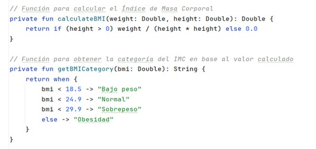
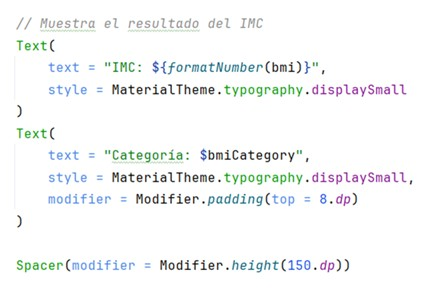

# Calculadora de IMC

Este es un proyecto de Android en Kotlin que implementa una calculadora de Índice de Masa Corporal (IMC) utilizando Jetpack Compose.

## Características
- Permite ingresar el peso en kilogramos.
- Permite ingresar la altura en centímetros.
- Calcula automáticamente el IMC.
- Muestra la categoría correspondiente del IMC.
- Diseño moderno con Jetpack Compose.

## Requisitos
- Android Studio Arctic Fox o superior.
- Kotlin 1.5 o superior.
- Redactar interfaz de usuario.

## Instalación
1. Abre el proyecto en Android Studio.
2. Compila y ejecuta la aplicación en un dispositivo o emulador.

## Uso
1. Introduce tu peso en kilogramos.
2. Introduce tu altura en centímetros.
3. La aplicación calculará y mostrará tu IMC junto con su categoría.

## Captura de Pantalla




## Código de la Aplicación

```kotlin
package com.example.imccalculator

import android.os.Bundle
import androidx.activity.ComponentActivity
import androidx.activity.compose.setContent
import androidx.activity.enableEdgeToEdge
import androidx.compose.foundation.Image
import androidx.compose.foundation.layout.*
import androidx.compose.foundation.rememberScrollState
import androidx.compose.foundation.text.KeyboardOptions
import androidx.compose.foundation.verticalScroll
import androidx.compose.material3.*
import androidx.compose.runtime.*
import androidx.compose.ui.Alignment
import androidx.compose.ui.Modifier
import androidx.compose.ui.res.painterResource
import androidx.compose.ui.text.input.KeyboardType
import androidx.compose.ui.tooling.preview.Preview
import androidx.compose.ui.unit.dp
import com.example.indicedemasacorporal.R
import com.example.indicedemasacorporal.ui.theme.IndiceDeMasaCorporalTheme
import java.text.DecimalFormat

class MainActivity : ComponentActivity() {
    override fun onCreate(savedInstanceState: Bundle?) {
        super.onCreate(savedInstanceState)
        enableEdgeToEdge()
        setContent {
            IndiceDeMasaCorporalTheme {
                Surface(
                    modifier = Modifier.fillMaxSize(),
                ) {
                    BMICalculatorLayout()
                }
            }
        }
    }
}

@Composable
fun BMICalculatorLayout() {
    var weightInput by remember { mutableStateOf("") }
    var heightInput by remember { mutableStateOf("") }
    var bmi by remember { mutableStateOf<Double?>(null) }

    Column(
        modifier = Modifier
            .padding(horizontal = 40.dp)
            .verticalScroll(rememberScrollState())
            .safeDrawingPadding(),
        horizontalAlignment = Alignment.CenterHorizontally,
        verticalArrangement = Arrangement.Center
    ) {
        Text(
            text = "Calculadora de IMC",
            modifier = Modifier.padding(bottom = 16.dp, top = 40.dp)
        )

        EditNumberField(
            label = "Peso (kg)",
            value = weightInput,
            onValueChanged = { weightInput = it },
            modifier = Modifier
                .fillMaxWidth()
                .padding(bottom = 16.dp)
        )

        EditNumberField(
            label = "Altura (cm)",
            value = heightInput,
            onValueChanged = { heightInput = it },
            modifier = Modifier
                .fillMaxWidth()
                .padding(bottom = 16.dp)
        )

        Button(
            onClick = {
                val weight = weightInput.toDoubleOrNull() ?: 0.0
                val height = heightInput.toDoubleOrNull()?.div(100) ?: 0.0
                bmi = if (weight > 0.0 && height > 0.0) calculateBMI(weight, height) else null
            },
            modifier = Modifier.padding(top = 16.dp)
        ) {
            Text(text = "Calcular IMC")
        }

        bmi?.let {
            Text(
                text = "IMC: ${formatNumber(it)}",
                style = MaterialTheme.typography.displaySmall,
                modifier = Modifier.padding(top = 16.dp)
            )
            Text(
                text = "Categoría: ${getBMICategory(it)}",
                style = MaterialTheme.typography.displaySmall,
                modifier = Modifier.padding(top = 8.dp)
            )
            Image(
                painter = painterResource(id = getBMIImageResource(it)),
                contentDescription = "Imagen de IMC",
                modifier = Modifier.size(150.dp).padding(top = 16.dp)
            )
        }
    }
}

@Composable
fun EditNumberField(
    label: String,
    value: String,
    onValueChanged: (String) -> Unit,
    modifier: Modifier
) {
    TextField(
        value = value,
        singleLine = true,
        modifier = modifier,
        onValueChange = onValueChanged,
        label = { Text(label) },
        keyboardOptions = KeyboardOptions(keyboardType = KeyboardType.Number)
    )
}

private fun calculateBMI(weight: Double, height: Double): Double {
    return weight / (height * height)
}

private fun getBMICategory(bmi: Double): String {
    return when {
        bmi < 18.5 -> "Bajo peso"
        bmi < 24.9 -> "Normal"
        bmi < 29.9 -> "Sobrepeso"
        else -> "Obesidad"
    }
}

private fun getBMIImageResource(bmi: Double): Int {
    return when {
        bmi < 18.5 -> R.drawable.indice_bajo_de_masa_corporal
        bmi < 24.9 -> R.drawable.indice_masa_corporal_normal
        bmi < 29.9 -> R.drawable.sobrepeso
        else -> R.drawable.obesidad_morbida__644x362
    }
}

private fun formatNumber(value: Double): String {
    return DecimalFormat("#.##").format(value)
}

@Preview(showBackground = true)
@Composable
fun BMICalculatorLayoutPreview() {
    IndiceDeMasaCorporalTheme {
        BMICalculatorLayout()
    }
}
